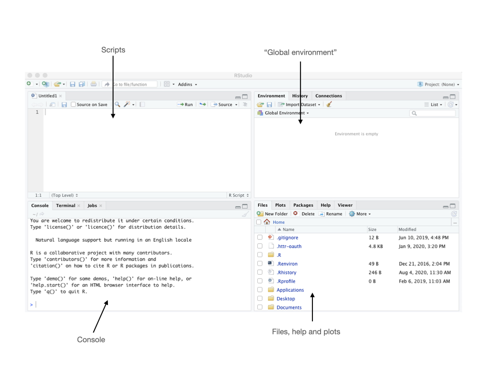
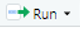

# Introduction to R

## Before you start

Make sure you have [R](https://cran.r-project.org) and [RStudio](https://rstudio.com/products/rstudio/download/) installed. If you have a mac, you also need to install Xtools from the app store. If you have windows you also need to install [Rtools](https://cran.r-project.org/bin/windows/Rtools/). 

## Getting around Rstudio

R studio is a friendlier way to use R. When you open RStudio you will see four panes. 

You can open a new script by clicking *File* > *New File* > *R Script*




We will work by typing in the script.

## R as a calculator

Now that you have seen all the potential that R has, let's go back to the basics and get started.

Let's play with some numbers. You can use R as a plain calculator doing all of the basic operations such as addition, multiplication, division and substraction. 

For instance, write a expresion (say 3 + 2) and then hit the run button 
 to execute the line.

```{r}
3 + 2

```

You can also do multiple calculations by using the semicolon (;) to separate multiple commands

```{r}
20 / 4; 14 - 8 

```


### Practice

Practice combining operators. Can you see the difference?

```{r}
14 - 8 * 2

```

```{r}
(14 - 8) * 2

```

<div style="padding: 15px; border: 1px solid transparent; border-color: transparent; margin-bottom: 20px; border-radius: 4px; color: #31708f; background-color: #d9edf7; border-color: #bce8f1;">
**<span style="color:green">Tips!</span>** 
The rules for the order of operations are important.

+ Patenthesis () first, then 
+ Exponents (powers and square roots), then
+ Multiplication and division (left-to-right), and finally
+ Addition and substraction (left-to-right)
</div>

## Functions

R has many built in functions for common operations you might have seen before such as: <span style="color:blue">"sqrt"</span>, <span style="color:blue">"log"</span>, <span style="color:blue">"abs"</span>.  

We will see lots of functions in R! And, R packages that are a collection of R functions. 

**Square Root**

```{r}
sqrt(25)

```

**Powers**

```{r}
3^2

```


**Absolute value**

```{r}
abs(-43)

```


**Natural logarithms (<span style="color:blue">"log"</span>**)
```{r}
log(10)

```

**Logarithms using base 10**
```{r}
log10(10)

```


<div style="padding: 15px; border: 1px solid transparent; border-color: transparent; margin-bottom: 20px; border-radius: 4px; color: #31708f; background-color: #d9edf7; border-color: #bce8f1;">
**<span style="color:green">Tips!</span>** 
R is case sensitive, so 'Log(10)' will not work at all.
</div>

<div style="padding: 15px; border: 1px solid transparent; border-color: transparent; margin-bottom: 20px; border-radius: 4px; color: #a94442; background-color: #f2dede; border-color: #ebccd1;">

You will get an error:

<span style="color:red">Error in Log10() : could not find function "Log10"</span>


</div>


**Trigonometric functions: e.g., sin (<span style="color:blue">"sin"</span>**)

```{r}
sin(pi/2)
```

## Mathematical constants

R also knows commonly used mathematical constants such as π

```{r}
pi

```


More generally, <span style="color:blue">Functions</span> will execute certain actions. You can call functions by writing the name of the function followed by round parenthesis ().

<div style="padding: 15px; border: 1px solid transparent; border-color: transparent; margin-bottom: 20px; border-radius: 4px; color: #31708f; background-color: #d9edf7; border-color: #bce8f1;">
**<span style="color:green">Tips!</span>** 

When you are typing the name of a function, R is actively searching for functions with similar spelling, so you can select the one you are looking for. See the example below:


<p align="center"></p>


</div>

---

Functions can be very useful. For instance, let's use **<span style="color:blue">"round"</span>** to round the mathematical constant 'π' to two decimal places.

```{r}

round(pi, 2)


```

rounds down, using **<span style="color:blue">"floor"</span>** function

```{r}

floor(19.8)

```

rounds up, using **<span style="color:blue">"ceiling"</span>** function

```{r}

ceiling(19.8)

```

---

<p align="center"><span style="color:black">**This is your turn!**</span></p>


<div style="padding: 15px; border: 1px solid transparent; border-color: transparent; margin-bottom: 20px; border-radius: 4px; color: #31708f; background-color: #d9edf7; border-color: #bce8f1;">
**<span style="color:green">Tips!</span>** 
<p align="center">Practice, practice, practice!!</p>


<p align="center">Hopefully you get lots of <span style="color:red">**Error**</span> messages.</p>


<p align="center">Try to understand what are the issues and solve them.</p>

<p align="center"> <span style="color:green">Your learning process will improve substantially</span> </p>
</div>


## What is an object in R

<div style="padding: 15px; border: 1px solid transparent; border-color: transparent; margin-bottom: 20px; border-radius: 4px; color: #3c763d; background-color: #dff0d8; border-color: #d6e9c6;">
R is an objet-oriented program. It means that everything in R is an object.

So, an object in R is a structure having some attributes (data type) and methods acting in its attributes.

</div>

Let's talk about the first part, the **data type**. For instance, the most basic data type in R is a **vector** which refers to an atomic quantity that can hold only one value.


```{r}

x <- 1
x

```

You can use vectors to build more complex ones.


---


Let's see types of vectors (modes: numeric, logic and character)


**Number**

```{r}

a <- 5
a

```

You can use the function **<span style="color:blue">"class"</span>** to see the 'mode' of the object.
```{r}

class(a)

```

```{r}


b <- 7
b
```

---

Checking for numeric type
```{r}


b <- 7
typeof(b)
```
All real numbers are stored in double precision format. If you requiered integer use the function **<span style="color:blue">"as.integer"</span>**:


```{r}


b <- 7
as.integer(b)
```


```{r}


s <- 10.2
as.integer(s)
```


---

**Logical value**


Is **a** larger than **b**? (Remember **a** is 5 and **b** is 7)
```{r}

m <- a > b
m
```


Is **a** smaller than **b**?
```{r}

n <- a < b
n
```

```{r}

class(n)
```
---

**Character (string)**


```{r}

c <- "rain"
c
```


```{r}

class(c)
```


Remember to use quotation marks to encapsule the string (e.g.,  "rain"). Otherwise you will get an error.  Try it!

---

Let's try this.  Numbers within quotation marks.

```{r}

d <- "8"

```

```{r}

e <- "9"

```
Then, d + e (are you expecting 17?)

<div style="padding: 15px; border: 1px solid transparent; border-color: transparent; margin-bottom: 20px; border-radius: 4px; color: #a94442; background-color: #f2dede; border-color: #ebccd1;">

You will get an error:

<span style="color:red">
Error in d + e : non-numeric argument to binary operator</span>

</div>

You can coerce these character mode objects into a number, using the function **<span style="color:blue">"as.numeric"</span>**
```{r}

as.numeric(d) + as.numeric(e)

```

---

At this point you might notice that we are using this operator:

<p align="center">**<-**</p>

<div style="padding: 15px; border: 1px solid transparent; border-color: transparent; margin-bottom: 20px; border-radius: 4px; color: #31708f; background-color: #d9edf7; border-color: #bce8f1;">
**<span style="color:green">Tips!</span>** 

**<-** is the preferred assigment operator in R.

**<-**  always means assigment.

Whereas **=** can mean assigment, function argument binding or case statement (you will see more details on this later on).

Good practice: use **<-** to assign values to an object.


should be used together and be written without using a space.


</div>


---


Data types


| |Same mode|Different mode|
|---|---|---|
| |||
|1 dimension |**Vector**  | **list**|
| |<span style="color:black">e.g., (2,3,4,5)</span>  | <span style="color:black">e.g., (3, "frog", 3.5, FALSE)</span> |
|2 dimension |**Matrix** | **data frame**|
| |||


---

Before entering the world of more complex data types, let's try to understand the second part of the the object's definition:

An object in R is a structure having some attributes (data type) and **methods acting in its attributes**.


The next slide is an example that will give you a general idea.

We will come back with more examples later on.


---

```{r}

c <- "25"

```

```{r}

class(c)

```
Let's try to perform this function sqrt(c)

<div style="padding: 15px; border: 1px solid transparent; border-color: transparent; margin-bottom: 20px; border-radius: 4px; color: #a94442; background-color: #f2dede; border-color: #ebccd1;">

You will get an error:

<span style="color:red">Error in sqrt(c) : non-numeric argument to mathematical function</span></div>

This is because **<span style="color:blue">"sqrt"</span>** does not work on objects of mode 'character'.

So, objects are not simply collection of data with different structures. Operations and functions are defined for speciefic classes and modes.


---

**Vectors**

<div style="padding: 15px; border: 1px solid transparent; border-color: transparent; margin-bottom: 20px; border-radius: 4px; color: #3c763d; background-color: #dff0d8; border-color: #d6e9c6;">
A vector is a sequence of data elements of the same mode. 

</div>


Let's use the function concatenate **<span style="color:blue">"c"</span>** to create a vector

```{r}

c(2,4,6,8,10)

```

Let's use the function **<span style="color:blue">"length"</span>** to know the number of elements in this vector
```{r}

length(c(2,4,6,8,10))

```


---

Let's add this vector to an object
```{r}

even_numbers <- c(2,4,6,8,10)
even_numbers

```
