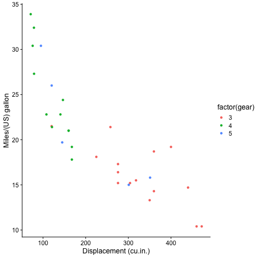

Introduction to R 
========================================================
author: Laura Melissa Guzman and Juan Zuloaga
date: 
autosize: true

Overview
========================================================
This is a series of R, statistics and conservation workshops.

The goals of these workshops are to:

- Introduce R
- Introduce basic concepts of statistics
- Apply the conceps from R and statistics to conservation problems 


What is R and RStudio?
========================================================

R is a open-source programming language commonly used for statistics

RStudio is an integrated development environment (IDE) for R -- A nice place to use R


Why use R?
========================================================

- R is free!
- R is the most common software used for statistical analyses
- R has an amazing community

What can I do with R?
========================================================


You can use R to produce really cool graphs!
========================================================


```r
ggplot(data = mtcars, aes(x = disp, y = mpg, colour = factor(gear))) + geom_point() + theme_cowplot() + xlab("Displacement (cu.in.)") + ylab("Miles/(US) gallon") 
```


